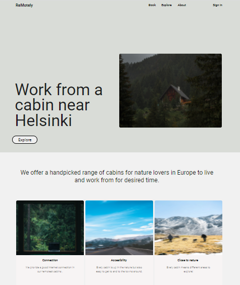

# [ReMotely](https://kakuliniec.github.io/ReMotely/) - project based on Figma. 
It is just for desktop view (1440px or more).

## The tools which will be used here:

* Figma
* Flexbox
* Grid
* SASS
* Visial Studio Code
* git
* ...

To run:
1. Npm install
2. Npm start

**E n j o y !** 😉 

